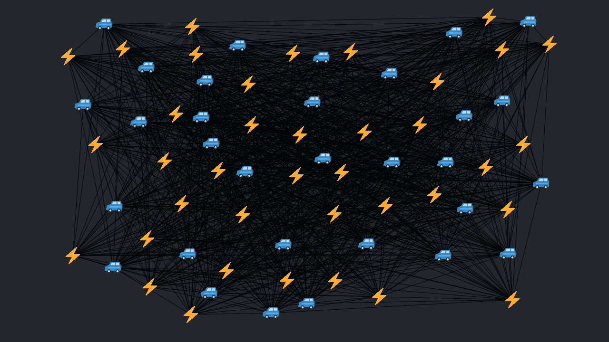

# ev-charging-optimization

A simulation of finding the shortest charging routes for electric vehicle fleets using ant colony optimization.



## Installation

```bash
# on Debian/Ubuntu
sudo apt install python3 pipenv libglfw3

# on macOS
brew install python3 pipenv glfw

cd ev-charging-optimization
pipenv sync
```

## Usage

```bash
pipenv run python ants.py
```
